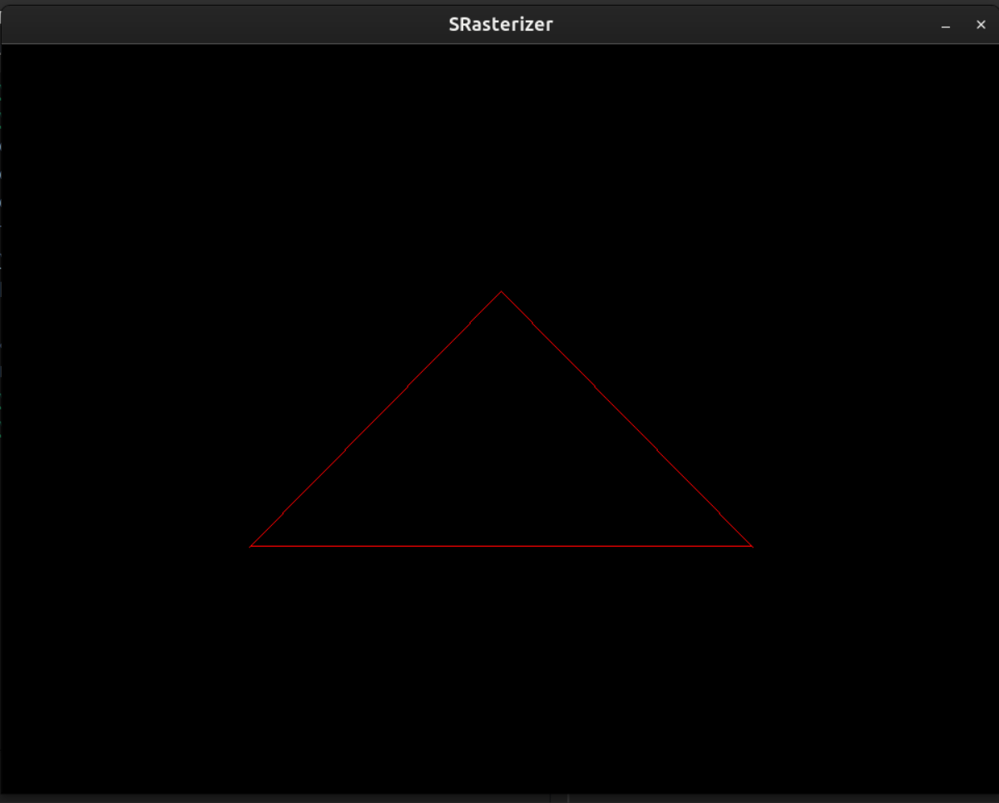

# SRasterizer
Here is our CPU Software Rasterizer project made during our first Computer Graphics year.

## Installation
```shell
git clone git@github.com:SakurayYuzuru/Rasterizer.git
```

## Compilation
If you plan to build our project, you should have :
- [SDL2](#Environment)
- CMake
- Make or other IDE  
And then you could build it with these code in your terminal.
```shell
mkdir build && cd build
cmake ..
make -j${nproc}
./SRasterizer
```

## Environment
- **Linux**:  
```shell
sudo apt-get update
sudo apt-get install libsdl2-dev
```
- **Windows** & **Mac**:  
[SDL2 Download](https://github.com/libsdl-org/SDL/releases/tag/release-3.2.4)

## Screenshots
### Bresen Ham's algorithm

